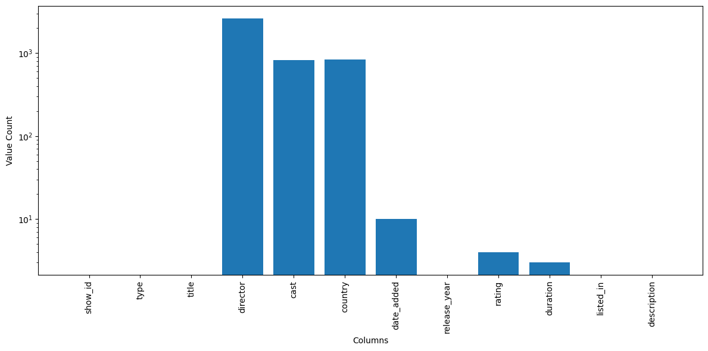

# Netflix Data Analysis

## Project Overview

- **Project Title:** Netflix Data Analysis    
- **Dataset:** `netflix_titles.csv`  

This project analyzes the Netflix dataset to uncover insights about movies and TV shows available on Netflix. It includes data preprocessing, exploration, and visualization using Python libraries such as `pandas`, `collections`, and `matplotlib`. The goal is to showcase skills in data analysis, preprocessing, and visualization.

---

## Objectives

1. **Preprocess the Dataset:** Clean and transform the dataset for analysis.  
2. **Perform Data Exploration:** Analyze key aspects of the dataset, such as genres, release years, and content types.  
3. **Visualize Insights:** Create visualizations to represent findings effectively.  
4. **Answer Key Questions:** Address specific questions about the dataset, such as the distribution of movies and TV shows, top genres, and content production trends and more.  

---

## Project Structure

### 1. Dataset Overview

The dataset used in this project is `netflix_titles.csv`, which contains information about Netflix titles, including:

- **Title**: Name of the movie or TV show.  
- **Type**: Whether it is a Movie or TV Show.  
- **Release Year**: Year the title was released.  
- **Date Added**: Date the title was added to Netflix.  
- **Listed In**: Genres or categories the title belongs to.  
- **Country**: Country of production.  
- **Cast**: Actors featured in the title.  
- **Director**: Director of the title.  
- **Rating**: Content rating.  
- **Duration**: Duration of the title (in minutes for movies or seasons for TV shows).  

---

### 2. Preprocessing

#### Task 1: Split the `listed_in` Column into Individual Genres
```python
netflix_titles['listed_in'] = netflix_titles['listed_in'].replace("'", "").str.split(', ')
```

#### Task 2: Extract Year from the `date_added` Column
```python
netflix_titles['date_added'] = pd.to_datetime(netflix_titles['date_added'], format='mixed')
netflix_titles['year_added'] = netflix_titles['date_added'].dt.year.astype('Int64')
```

#### Task 3: Split the `cast` Column into Individual Actors
```python
netflix_titles['cast'] = netflix_titles['cast'].replace("'", "").str.split(", ")
```

#### Task 4: Split the `country` Column into Individual Countries
```python
netflix_titles['country'] = netflix_titles['country'].replace("'", "").str.split(', ')
netflix_titles['country'] = netflix_titles['country'].apply(lambda x: x if isinstance(x, list) else [])
```

---

### 3. Data Analysis & Findings

#### Task 5: Total Number of Movies and TV Shows
```python
netflix_titles['type'].value_counts()
```

5
#### Task 6: Display the distinct release years represented in the dataset
```python
netflix_titles['release_year'].unique()
```


#### Task 7: Movies and TV Shows Released Each Year
```python
netflix_titles.groupby('release_year')['type'].count()
```


#### Task 8: Top 5 Most Frequent Genres
```python
genre_counter = Counter()
for genres in netflix_titles['listed_in']:
    if isinstance(genres, list):
        for genre in genres:
            genre_counter[genre.strip()] += 1
genre_counter.most_common(5)
```


#### Task 9: Number of Titles Featuring Om Puri
```python
actor_counter = Counter()
for actors in netflix_titles['cast']:
    if isinstance(actors, list):
        for actor in actors:
            actor_counter[actor.strip()] += 1
print(f"Om Puri was cast in {actor_counter['Om Puri']} Movies/TV Shows")
```


#### Task 10: Top 5 Countries Producing the Most Content
```python
country_counter = Counter()
for countries in netflix_titles['country']:
    if isinstance(countries, list):
        for country in countries:
            country_counter[country.strip()] += 1
country_counter.most_common(5)
```


#### Task 11: Identify how many movies in the Netflix dataset are classified as 'Music & Musicals', produced in India.

#### Custom Exploding Function

#### Expanding DataFrame Based on Two Columns Containing Lists:
```python
def custom_explode(df, col1, col2):
    new_rows = []
    for _, row in df.iterrows():
        lencol1 = len(row[col1])
        lencol2 = len(row[col2])
        if lencol1 > 0 and lencol2 > 0:
            for i in range(max(lencol1, lencol2)):
                new_row = row.copy()
                new_row[col1] = row[col1][i % lencol1]
                new_row[col2] = row[col2][i % lencol2]
                new_rows.append(new_row)
        elif lencol1 > 0:
            for j in range(lencol1):
                new_row = row.copy()
                new_row[col1] = row[col1][j]
                new_rows.append(new_row)
        elif lencol2 > 0:
            for k in range(lencol2):
                new_row = row.copy()
                new_row[col2] = row[col2][k]
                new_rows.append(new_row)
        else:
            new_rows.append(row.to_dict())
    return pd.DataFrame(new_rows)

exploded_df = custom_explode(netflix_titles, 'listed_in', 'country')
```


#### 
```python
len(exploded_df[((exploded_df['type'] == 'Movie') & 
                 (exploded_df['listed_in'] == 'Music & Musicals')) & 
                 (exploded_df['country'] == 'India')])
```


#### Task 12: Titles Released in 2020
```python
netflix_titles[netflix_titles['release_year'] == 2020]['title']
```


#### Task 13: Titles Produced in India
```python
netflix_titles[netflix_titles['country'] == 'India']['title']
```


#### Task 14: Top 10 Directors
```python
netflix_titles['director'].value_counts().sort_values(ascending=False).head(10)
```


#### Task 15: Maximum Duration of a Movie
```python
movies = netflix_titles[netflix_titles['type'] == 'Movie'].copy()
movies[['duration_value', 'duration_unit']] = movies['duration'].str.extract(r'(\d+) (min|Season(?:s)?)', expand=True)
movies['duration_value'] = pd.to_numeric(movies['duration_value'])
movies['duration_value'].max()
```


#### Task 16: Maximum Duration of a TV Show
```python
TV_shows = netflix_titles[netflix_titles['type'] == 'TV Show'].copy()
TV_shows[['duration_value', 'duration_unit']] = TV_shows['duration'].str.extract(r'(\d+) (:min|Season(?:s)?)', expand=True)
TV_shows['duration_value'].max()
```


#### Task 17: Titles Added to Netflix Each Year
```python
netflix_titles.groupby('year_added')['title'].count().sort_values(ascending=False)
```


#### Task 18: Movies and TV Shows Released Each Year
```python
netflix_titles.groupby(['release_year', 'type'])['type'].count()
```


---

### 4. Visualizations

#### Task 19: Null Values in the Dataset
```python
missing_values = netflix_titles.isnull().sum()
missing_df = pd.DataFrame(missing_values, columns=['Missing Value(count)'])
plt.figure(figsize=(12, 6))
plt.bar(missing_df.index, missing_df['Missing Value(count)'])
plt.yscale('log')
plt.xlabel('Columns')
plt.ylabel('Value Count')
plt.xticks(rotation='vertical')
plt.tight_layout()
plt.show()
```
####

####

#### Task 20: Movies and TV Shows Released Each Year (Bar Chart)
```python
netflix_titles['release_year'].value_counts().plot(kind='bar', width=0.7)
```
####

####

#### Task 21: Number of Movies and TV Shows (Bar Graph)
```python
netflix_titles['type'].value_counts().plot(kind='bar')
```
####

####
---

## Conclusion

This project provides a comprehensive analysis of Netflix titles, including preprocessing, exploration, and visualization. It answers key questions about the dataset and uncovers insights into genres, countries, directors, and more.

---

## How to Use

1. **Clone the Repository:** Clone this repository to your local machine.  
   ```bash
   git clone https://github.com/Ameer-Hamza-Ch/Netflix-Data-Analysis-Using-Python.git
   ```
2. **Install Required Libraries:** Install the necessary Python libraries.  
   ```bash
   pip install pandas matplotlib
   ```
3. **Run the Jupyter Notebook or Python Script:** Execute the code to perform the analysis.  

---

**Author:** Muhammad Ameer Hamza    
**Email:** hamzachaudry33@gmail.com  

---
